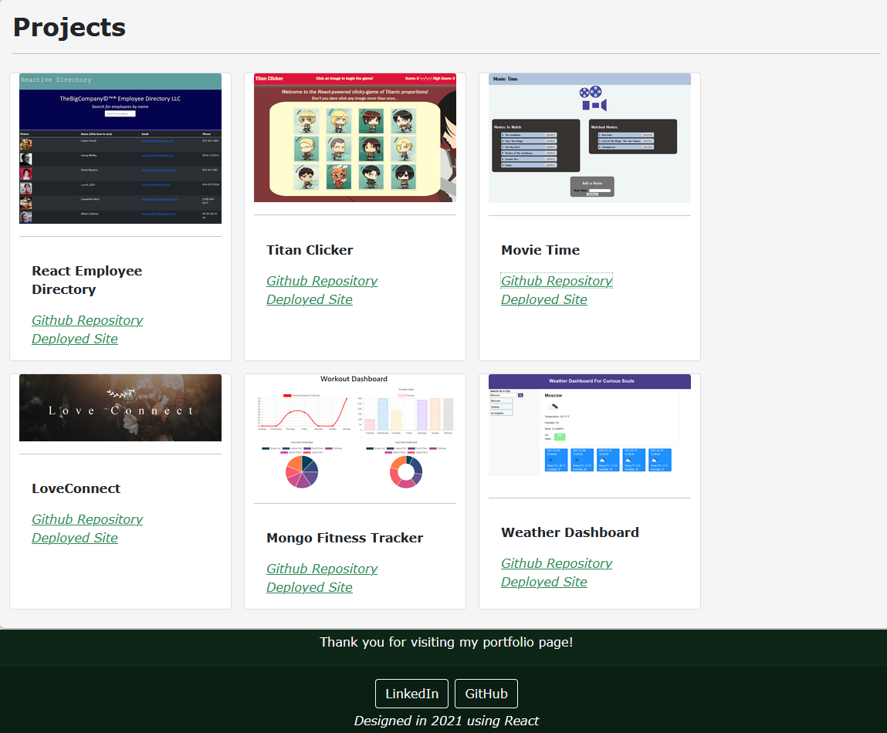

# Rand Hale React Portfolio

## Description
This [webpage](https://prophetrand.github.io/portefeuille-reactif/) deployed on GitHub Pages is my personal portfolio page built using the React library for dynamically rendering UI components. Using React to build the page is extremely useful for editing individual components and to make future modifications to the data supplied to those components.


## Table of Contents
* [Technologies Used](#technologies-used)
* [How to Access](#how-to-access)
* [What I Did](#what-i-did)
* [Code Snippets](#code-snippets)
* [Screenshots](#screenshots)
* [Acknowledgments](#acknowledgments*)
* [Who I Am](#who-i-am)

---

## Technologies Used
* [React](https://reactjs.org/) for building a dynamic, component-based UI for this webpage using JavaScript and JSX.
* [Git](https://git-scm.com/) for distributed version control, tracking changes over time and making them visible to collaborators.
* [Github](https://github.com/) for version control in the cloud, saving my changes and presenting them clearly to myself and others.

## How to Access
This webpage is accessible on most browsers and is hosted on GitHub Pages. The site can be [accessed here](https://prophetrand.github.io/portefeuille-reactif/), and here: <https://prophetrand.github.io/portefeuille-reactif/>

---

## What I Did
I created three pages to comprise this portfolio: Home, About, and Projects. The Home and About pages are presently static, "dumb" components that load the same content regardless of input. In contrast, the Projects page loads repeated Project components dynamically from data in `project-info.json`, which includes each project's title, links to their respective GitHub repositories and deployed URLs, and small images of each project. When I add or change the projects in the JSON file, the Projects page will reflect those changes fluidly.

## Code Snippets 
The snippet below reflects the JSX that I used for each Project card displayed on the Projects page. First a style object is declared for a simple modification to anchor `<a>` elements in the component. The component itself returns a block of JSX that resembles HTML that React will render to the DOM. A set of `props` are passed to the functional component by its parent element, and individual keys on that props object are accessed in the JSX to render the unique values of each project object as written in `project-info.json`.

```javascript
const styles = {
    a:  {
        color: "seagreen",
        fontStyle: "italic"
    }
}

function Project(props) {
  return (
    <div className="card m-2" style={{ width: "18rem" }}>
      
      <hr />
      <div className="card-body">
        <p className="card-text" style={{ fontWeight: "bold" }}>{props.title}</p>
        <a style={styles.a} target="_blank" rel="noreferrer" href={props.repo} >Github Repository</a><br />
        <a style={styles.a} target="_blank" rel="noreferrer" href={props.deployed} >Deployed Site</a>
      </div>
    </div>
  );
}
```

## Screenshots
Example of the Projects page described by the code snippet above:


---

## Acknowledgments
* [Random User Generator](https://randomuser.me/) is a free API that I used to generate a fictional employee roster. It provides a robust list of employee data in JSON format and is incredibly useful for doing just that in an easily accesible way.
* [W3Schools](https://www.w3schools.com/) has been my go-to for descriptive tutorials on HTML, CSS, and Javascript syntax and best practices. I am eternally grateful for their massive store of documentation.
* [MDN Web Docs](https://developer.mozilla.org/en-US/) is another resource for documentation on HTML, CSS, and Javascript that I find myself using more and more often as I work through deeper Javascript.

## Who I Am
My name is Rand Hale, and I am an aspiring programmer/web developer based in California.

* [LinkedIn](https://www.linkedin.com/in/rand-hale-83ba389b/)
* [GitHub](https://github.com/prophetrand)
* [Porfolio](https://prophetrand.github.io/portefeuille-reactif/)